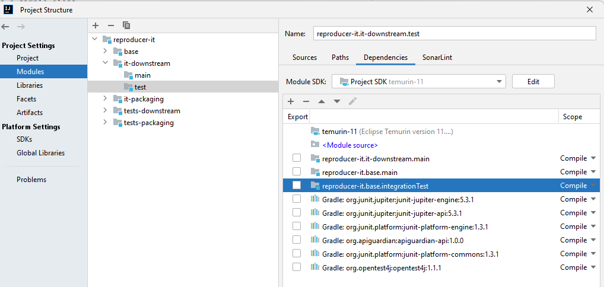
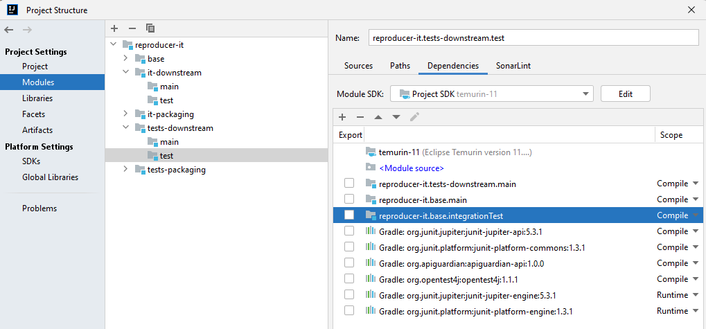
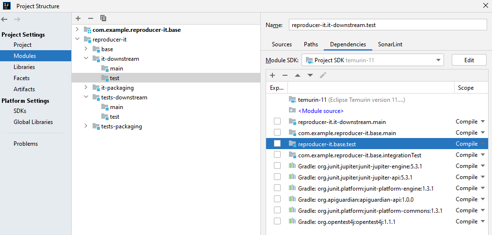
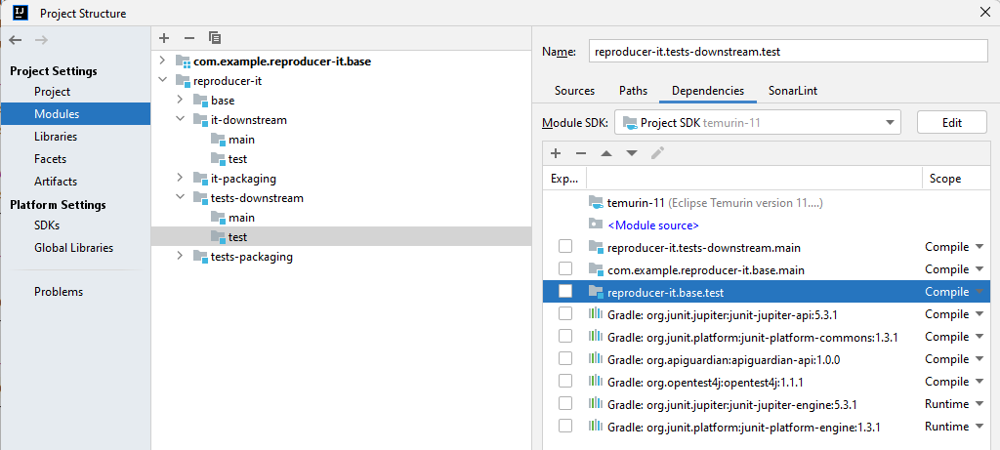

# reproducer for IDEA-321592

With intellij IDEA 2023.x there are some problems with cross project dependencies on specific configurations.
see https://youtrack.jetbrains.com/issue/IDEA-321592 for details

## setup

### base 
- holds a simple class
- a integrationTest setup based on https://github.com/unbroken-dome/gradle-testsets-plugin
- a custom `tests` configuration (do not mistake this for the default `test` configuration for unit tests) that only has the `jar` containing the `integrationTest` classes (this is our current setup)

### it-* projects
- consume the `integrationTest` configuration directly either as test dependency or for packaging
- this way all `integrationTest` dependencies are also coming with it

### tests-* projects
- consume the `tests` configuration 
- no transitive dependencies apply in this scenario

## outcome in Intellij IDEA 2022

- it-downstream 
- tests-downstream 

## outcome in Intellij IDEA 2023
- it-downstream 
- tests-downstream 

that shows, that the 2023 versions are depending on the `test` module instead of the `integrationTest` how it should be.